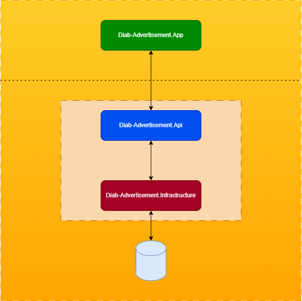

## Infrastruktur

Das Projekt besteht aus zwei Haupt-Projekten Front- und Back-End Projete

- Frontend wird mit Angular entwickelt

- Backend wird mit Microsoft .Net Webservice entwickelt

Die Daten werden in eine MS SQL Server Datenbank gespeichert.

Nur der Webservice hat Zugriff auf die Datenbank, die Frontend-Anwendung greift auf den Webservice zu, um die Daten aus der Datenbank abzurufen.

### [zurück](./readme.md#diab-advertisement)
